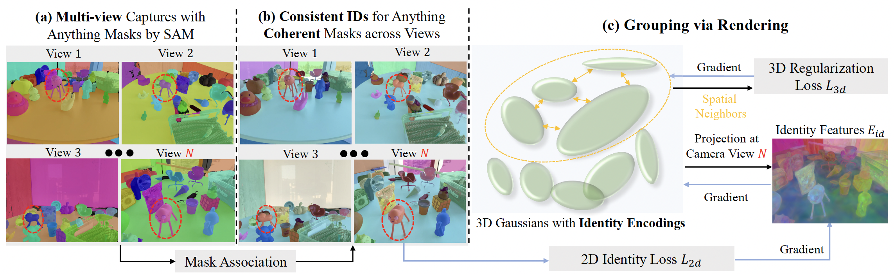
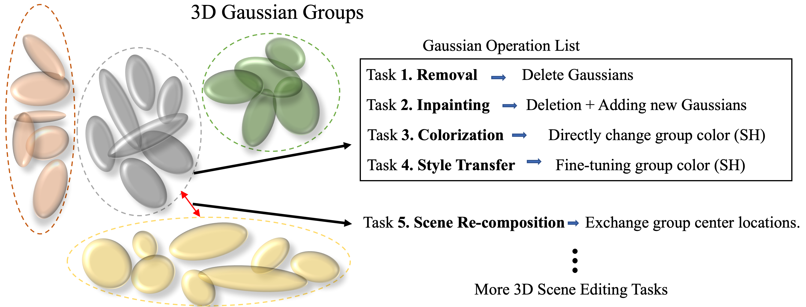

# Gaussian Grouping

> [**Gaussian Grouping: Segment and Edit Anything in 3D Scenes**](https://arxiv.org/abs/2312.00732)           
> [[Project Page]](https://ymq2017.github.io/gaussian-grouping)           
> arXiv 2023  
> ETH Zurich

We propose Gaussian Grouping, which extends Gaussian Splatting to jointly **reconstruct** and **segment** anything in open-world 3D scenes via **lifting 2D SAM**. It also efficiently supports versatile 3D scene **editing** tasks. Refer to our [paper](https://arxiv.org/abs/2312.00732) for more details.


Updates
-----------------
:fire::fire: 2024/01/16: We released the [LERF-Mask dataset](docs/dataset.md) and evaluation code.

2024/01/06: We released the [3D Object Removal & Inpainting](docs/edit_removal_inpaint.md) code.

2023/12/20: We released the [Install Notes](docs/install.md) and [Training & Rendering](docs/train.md) code.


# Introduction
The recent Gaussian Splatting achieves high-quality and real-time novel-view synthesis of the 3D scenes. However, it is solely concentrated on the appearance and geometry modeling, while lacking in fine-grained object-level scene understanding. To address this issue, we propose Gaussian Grouping, which extends Gaussian Splatting to jointly reconstruct and segment anything in open-world 3D scenes. We augment each Gaussian with a compact Identity Encoding, allowing the Gaussians to be grouped according to their object instance or stuff membership in the 3D scene. Instead of resorting to expensive 3D labels, we supervise the Identity Encodings during the differentiable rendering by leveraging the 2D mask predictions by SAM, along with introduced 3D spatial consistency regularization. Comparing to the implicit NeRF representation, we show that the discrete and grouped 3D Gaussians can reconstruct, segment and edit anything in 3D with high visual quality, fine granularity and efficiency. Based on Gaussian Grouping, we further propose a local Gaussian Editing scheme, which shows efficacy in versatile scene editing applications, including 3D object removal, inpainting, colorization and scene recomposition.



# Application Overview
**Local Gaussian Editing scheme**: Grouped Gaussians after training. Each group represents a specific instance / stuff of the 3D scene and can be fully decoupled.


## 3D Object Removal
Our Gaussian Grouping can remove the large-scale objects on the Tanks & Temples dataset, from the whole 3D scene with greatly reduced artifacts. Zoom for better view.

https://github.com/lkeab/gaussian-grouping/assets/17427852/f3b0f964-a610-49ab-8332-f2caa64fbf45

## 3D Object Inpainting
Comparison on 3D object inpainting cases, where SPIn-NeRF requires 5h training while our method with better inpainting quality only needs 1 hour training and 20 minutes tuning.

https://github.com/lkeab/gaussian-grouping/assets/17427852/9f5050da-6a50-4a5f-a755-3bdc55eab1bc

https://github.com/lkeab/gaussian-grouping/assets/17427852/3ed0203c-0047-4333-8bf0-0c10f5a078d1

## 3D Object Style Transfer
Comparison on 3D object style transfer cases, Our Gaussian Grouping produces more coherent and natural transfer results across views, with faithfully preserved background.

https://github.com/lkeab/gaussian-grouping/assets/17427852/2f00eab5-590b-4295-bb1c-2076acc63d4a

## 3D Open-world Segmentation
Our Gaussian Grouping approach jointly reconstructs and segments anything in full open-world 3D scenes. The masks predicted by Gaussian Grouping contains much sharp and accurate boundary than LERF.

https://github.com/lkeab/gaussian-grouping/assets/60028943/38241b99-1497-4a7c-bd22-5b018b85548c


## 3D Multi-Object Editing
Our Gaussian Grouping approach jointly reconstructs and segments anything in full open-world 3D scenes. Then we concurrently perform 3D object editing for several objects.

https://github.com/lkeab/gaussian-grouping/assets/17427852/d9638a1c-1569-4c72-91b9-ee68e9e017e5

# Installation
You can refer to the [install document](./docs/install.md) to build the Python environment.

# Training and Masks Rendering
Then refer to the [train document](./docs/train.md) to train your own scene.

# Open-Vocabulary Segmentation
For evaluation on the **LERF-Mask dataset** proposed in our paper, you can refer to the [dataset document](./docs/dataset.md).

# 3D Object Removal and Inpainting
You can select the 3D object for removal and inpainting after training. Details are in the [edit removal inpaint document](./docs/edit_removal_inpaint.md).


Citation
---------------
If you find Gaussian Grouping useful in your research or refer to the provided baseline results, please star :star: this repository and consider citing :pencil::
```
@article{gaussian_grouping,
  title={Gaussian Grouping: Segment and Edit Anything in 3D Scenes},
  author={Ye, Mingqiao and Danelljan, Martin and Yu, Fisher and Ke, Lei},
  journal={arXiv preprint arXiv:2312.00732},
  year={2023}
}
```
