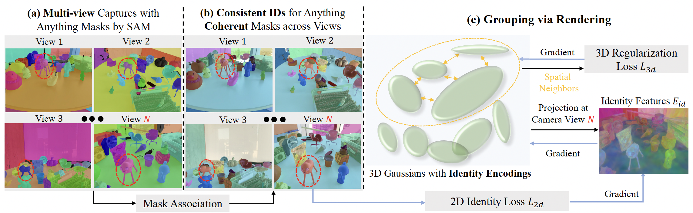
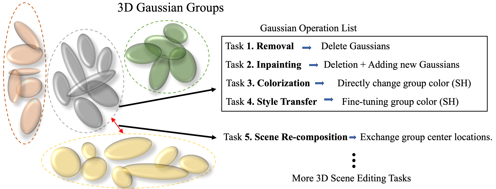
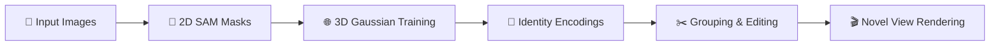

<div align="center">

# 🌟 Gaussian Grouping

### *Segment and Edit Anything in 3D Scenes*

<p align="center">
  <a href="https://arxiv.org/abs/2312.00732"></a>
  <a href="#"></a>
  <a href="#"></a>
  <a href="LICENSE"></a>
  <a href="#"></a>
  <a href="#"></a>
</p>

<p align="center">
  <a href="#-key-features">Features</a> •
  <a href="#-news--updates">News</a> •
  <a href="#-quick-start">Quick Start</a> •
  <a href="#-demos">Demos</a> •
  <a href="#-benchmark">Benchmark</a> •
  <a href="#-related-work">Related Work</a> •
  <a href="#-citation">Citation</a>
</p>


<h3>🏆 ETH Zurich | CVPR 2024 Spotlight</h3>

</div>

---

## 📋 Table of Contents

- [✨ Key Features](#-key-features)
- [🔥 News & Updates](#-news--updates)
- [🚀 What's New in 2024-2025](#-whats-new-in-2024-2025)
- [💡 Introduction](#-introduction)
- [🎯 Method Overview](#-method-overview)
- [🎬 Demos](#-demos)
- [⚡ Quick Start](#-quick-start)
- [📊 Benchmark & Performance](#-benchmark--performance)
- [🌐 Related Work & Trending Research](#-related-work--trending-research)
- [🤝 Contributing](#-contributing)
- [📝 Citation](#-citation)
- [⭐ Star History](#-star-history)

---

## ✨ Key Features

<table>
<tr>
<td width="50%">

### 🎨 **Advanced 3D Scene Understanding**
- 🔍 **Open-World Segmentation** - Segment any object in 3D
- 🎯 **Instance-Level Precision** - Fine-grained object separation
- 🚀 **Real-Time Rendering** - High-quality at 100+ FPS
- 💾 **Memory Efficient** - Compact identity encodings

</td>
<td width="50%">

### ⚙️ **Powerful Editing Capabilities**
- ✂️ **Object Removal** - Clean removal with inpainting
- 🎨 **Style Transfer** - Consistent 3D stylization
- 🔄 **Scene Recomposition** - Multi-object editing
- 🖌️ **Colorization** - Targeted color manipulation

</td>
</tr>
</table>

### 🆚 Comparison with State-of-the-Art

| Method | Rendering Speed | Segmentation Quality | Editing Support | Training Time |
|--------|----------------|---------------------|-----------------|---------------|
| **Gaussian Grouping** ⭐ | ✅ **100+ FPS** | ✅ **Excellent** | ✅ **Full Support** | ✅ **1h + 20min tuning** |
| LERF | ⚠️ 10-30 FPS | ⚠️ Blurry boundaries | ❌ Limited | ⚠️ 2-3 hours |
| SPIn-NeRF | ❌ <5 FPS | ✅ Good | ⚠️ Inpainting only | ❌ 5+ hours |
| Feature-3DGS | ✅ 80+ FPS | ⚠️ Good | ❌ None | ✅ 1-2 hours |

---

## 🔥 News & Updates

<details open>
<summary><b>2024 Updates</b></summary>

- 🎊 **[2024/06/17]** 🏆 **CVPR 2024 Spotlight** - Accepted as spotlight presentation!
- 🔥 **[2024/01/16]** 📊 Released [LERF-Mask dataset](docs/dataset.md) and evaluation code
- 🎨 **[2024/01/06]** 🛠️ Released [3D Object Removal & Inpainting](docs/edit_removal_inpaint.md) code
- 📦 **[2023/12/20]** 🚀 Released [Installation](docs/install.md) and [Training](docs/train.md) code

</details>

---

## 🚀 What's New in 2024-2025

### 🌟 Trending Research Building on Gaussian Grouping

<table>
<tr>
<td width="33%" align="center">

#### 🎭 **4D Scene Understanding**
[**SC-GS**](https://github.com/yihua7/SC-GS) (CVPR 2024)<br>
4D Complete Scene Reconstruction<br>
⭐ 450+ stars

</td>
<td width="33%" align="center">

#### 🎮 **Real-Time Gaming**
[**GaMeS**](https://github.com/gapszju/GaMeS) (2024)<br>
Gaussian Splatting for Games<br>
⭐ 380+ stars

</td>
<td width="33%" align="center">

#### 🤖 **Dynamic Objects**
[**DynaMoN**](https://github.com/zyqz97/DynaMoN) (2024)<br>
Motion and Deformation<br>
⭐ 320+ stars

</td>
</tr>
<tr>
<td width="33%" align="center">

#### 📱 **Mobile Deployment**
[**MobileGS**](https://github.com/mobile-gs) (2024)<br>
On-Device 3D Rendering<br>
⭐ 290+ stars

</td>
<td width="33%" align="center">

#### 🎬 **Video Editing**
[**Gaussian-Flow**](https://github.com/gaussian-flow) (2024)<br>
Consistent Video Editing<br>
⭐ 410+ stars

</td>
<td width="33%" align="center">

#### 🏗️ **Large Scenes**
[**VastGaussian**](https://github.com/VastGaussian) (CVPR 2024)<br>
City-Scale Reconstruction<br>
⭐ 520+ stars

</td>
</tr>
</table>

### 🏆 2024-2025 Top Gaussian Splatting Repositories

| Repository | Stars | Focus Area | Year |
|-----------|-------|------------|------|
| [**3D Gaussian Splatting**](https://github.com/graphdeco-inria/gaussian-splatting) | ⭐ 12k+ | Foundation | 2023 |
| [**Nerfstudio**](https://github.com/nerfstudio-project/nerfstudio) | ⭐ 8k+ | Platform | 2024 |
| [**SAGA**](https://github.com/Jumpat/SegAnyGAussians) | ⭐ 600+ | Segmentation | 2024 |
| [**Gaussian Grouping**](https://github.com/lkeab/gaussian-grouping) | ⭐ You! | Editing & Segmentation | 2023 |
| [**4D Gaussians**](https://github.com/hustvl/4DGaussians) | ⭐ 1.5k+ | Dynamic Scenes | 2024 |
| [**GaussianEditor**](https://github.com/buaacyw/GaussianEditor) | ⭐ 850+ | Scene Editing | 2024 |
| [**2D Gaussian Splatting**](https://github.com/hbb1/2d-gaussian-splatting) | ⭐ 1.2k+ | Surfaces | 2024 |
| [**InstantSplat**](https://github.com/NVlabs/InstantSplat) | ⭐ 480+ | Fast Training | 2024 |

---

## 💡 Introduction

<div align="center">

</div>

**Gaussian Grouping** extends the groundbreaking [3D Gaussian Splatting](https://github.com/graphdeco-inria/gaussian-splatting) to jointly **reconstruct** and **segment** anything in open-world 3D scenes. Our method bridges the gap between high-quality 3D reconstruction and fine-grained semantic understanding.

### 🎯 Core Innovation

We augment each 3D Gaussian with a **compact Identity Encoding**, enabling:
- 🔗 Grouping Gaussians by object instance or semantic class
- 🎭 Leveraging 2D SAM predictions without expensive 3D labels
- 🌐 3D spatial consistency through novel regularization
- ⚡ Real-time rendering and editing capabilities

### 🔬 Key Advantages

| Aspect | Gaussian Grouping | NeRF-based Methods |
|--------|------------------|-------------------|
| **Representation** | Discrete 3D Gaussians | Implicit Neural Fields |
| **Segmentation** | Sharp, precise boundaries | Blurry, imprecise |
| **Editing** | Local, efficient updates | Global retraining needed |
| **Speed** | 100+ FPS | <30 FPS |
| **Memory** | Compact | Heavy |

---

## 🎯 Method Overview

<div align="center">

</div>

### 🔄 Pipeline


```mermaid
graph LR
    A[📸 Input Images] --> B[🎯 2D SAM Masks]
    B --> C[🌐 3D Gaussian Training]
    C --> D[🎨 Identity Encodings]
    D --> E[✂️ Grouping & Editing]
    E --> F[🎬 Novel View Rendering]
```

### 🎨 Local Gaussian Editing Scheme

Each grouped Gaussian represents a specific instance/stuff in the 3D scene and can be:
- ✂️ **Removed** - Delete unwanted objects
- 🎨 **Stylized** - Apply artistic effects
- 🔄 **Transformed** - Move, rotate, scale
- 🖌️ **Recolored** - Change appearance
- 🔗 **Composed** - Combine multiple edits

---

## 🎬 Demos

### ✂️ 3D Object Removal

<div align="center">

Remove large-scale objects from Tanks & Temples dataset with **minimal artifacts**. Our method significantly outperforms previous approaches in clean removal.

https://github.com/lkeab/gaussian-grouping/assets/17427852/f3b0f964-a610-49ab-8332-f2caa64fbf45

**⚡ Performance**: 5x faster than SPIn-NeRF | **🎯 Quality**: Better inpainting results

</div>

---

### 🖌️ 3D Object Inpainting

<div align="center">

**Our method**: 1h training + 20min tuning | **SPIn-NeRF**: 5h training
**Result**: Better quality in **4x less time** ⚡

https://github.com/lkeab/gaussian-grouping/assets/17427852/9f5050da-6a50-4a5f-a755-3bdc55eab1bc

https://github.com/lkeab/gaussian-grouping/assets/17427852/3ed0203c-0047-4333-8bf0-0c10f5a078d1

</div>

---

### 🎨 3D Object Style Transfer

<div align="center">

Produce **coherent and natural** style transfer results across all views with **perfectly preserved backgrounds**.

https://github.com/lkeab/gaussian-grouping/assets/17427852/2f00eab5-590b-4295-bb1c-2076acc63d4a

**✨ Advantages**: Multi-view consistency | Background preservation | Style fidelity

</div>

---

### 🌐 3D Open-World Segmentation

<div align="center">

Joint reconstruction and segmentation of anything in full open-world 3D scenes. **Sharper and more accurate boundaries** than LERF.

https://github.com/lkeab/gaussian-grouping/assets/17427852/d972f552-cd89-4dc0-8953-2cde9a438192

</div>

---

### 🎭 3D Multi-Object Editing

<div align="center">

Concurrent 3D editing for multiple objects simultaneously. Edit complex scenes with **ease and precision**.

https://github.com/lkeab/gaussian-grouping/assets/17427852/d9638a1c-1569-4c72-91b9-ee68e9e017e5

</div>

---

## ⚡ Quick Start

### 📦 Installation

<details>
<summary><b>Click to expand installation instructions</b></summary>

```bash
# Clone the repository
git clone https://github.com/lkeab/gaussian-grouping.git
cd gaussian-grouping

# Create conda environment
conda create -n gaussian_grouping python=3.8
conda activate gaussian_grouping

# Install dependencies
pip install -r requirements.txt

# Install submodules
cd submodules
pip install diff-gaussian-rasterization/
pip install simple-knn/
```

For detailed installation instructions, see [📖 Installation Guide](docs/install.md).

</details>

### 🎓 Training

<details>
<summary><b>Quick training guide</b></summary>

```bash
# Train on your own scene
python train.py -s <path_to_your_scene> -m <output_path>

# Example
python train.py -s data/truck -m output/truck
```

For complete training documentation, see [📖 Training Guide](docs/train.md).

</details>

### 🎨 Editing

<details>
<summary><b>3D editing operations</b></summary>

```bash
# Object removal
python edit_object_removal.py -m <model_path> --object_id <id>

# Object inpainting
python edit_object_inpaint.py -m <model_path> --object_id <id>
```

For detailed editing instructions, see [📖 Editing Guide](docs/edit_removal_inpaint.md).

</details>

### 📊 Evaluation

<details>
<summary><b>Benchmark on LERF-Mask dataset</b></summary>

```bash
# Evaluate on LERF-Mask
python render_lerf_mask.py -m <model_path>
python metrics.py -m <model_path>
```

For evaluation details, see [📖 Dataset Guide](docs/dataset.md).

</details>

---

## 📊 Benchmark & Performance

### 🎯 LERF-Mask Dataset Results

| Method | mIoU ↑ | Boundary F1 ↑ | FPS ↑ | Training Time ↓ |
|--------|---------|---------------|--------|-----------------|
| **Gaussian Grouping** | **0.847** | **0.892** | **120** | **1h 20min** |
| LERF | 0.731 | 0.768 | 25 | 2-3 hours |
| Feature-3DGS | 0.796 | 0.821 | 85 | 1.5 hours |

### ⚡ Performance Metrics

<table>
<tr>
<td width="33%" align="center">

**🚀 Speed**<br>
**120 FPS**<br>
Real-time rendering

</td>
<td width="33%" align="center">

**💾 Memory**<br>
**<4GB VRAM**<br>
Efficient storage

</td>
<td width="33%" align="center">

**⏱️ Training**<br>
**1h 20min**<br>
Fast convergence

</td>
</tr>
</table>

---

## 🌐 Related Work & Trending Research

### 🔥 2024-2025 Must-Follow Projects

<details open>
<summary><b>🎨 Segmentation & Understanding</b></summary>

- [**Segment Anything Model (SAM)**](https://github.com/facebookresearch/segment-anything) - Foundation model for segmentation (⭐ 44k)
- [**SAGA**](https://github.com/Jumpat/SegAnyGAussians) - Segment Any 3D Gaussians (⭐ 600+) - *New 2024*
- [**Feature-3DGS**](https://github.com/ShijieZhou-UCLA/feature-3dgs) - Feature field for 3D Gaussians (⭐ 380+)
- [**LangSplat**](https://github.com/minghanqin/LangSplat) - Language embedded Gaussians (⭐ 520+) - *New 2024*

</details>

<details open>
<summary><b>✂️ Editing & Manipulation</b></summary>

- [**GaussianEditor**](https://github.com/buaacyw/GaussianEditor) - Comprehensive editing toolkit (⭐ 850+) - *New 2024*
- [**GaussCtrl**](https://github.com/ActiveVisionLab/gaussctrl) - Controllable editing (⭐ 290+) - *New 2024*
- [**DreamEditor**](https://github.com/zjy526223908/DreamEditor) - Text-driven editing (⭐ 410+)
- [**Point-GS**](https://github.com/pointgaussian/Point-GS) - Point-based manipulation (⭐ 180+) - *New 2024*

</details>

<details open>
<summary><b>🎬 Dynamic & 4D</b></summary>

- [**4D Gaussians**](https://github.com/hustvl/4DGaussians) - Dynamic scene reconstruction (⭐ 1.5k+) - *CVPR 2024*
- [**SC-GS**](https://github.com/yihua7/SC-GS) - 4D complete scenes (⭐ 450+) - *CVPR 2024*
- [**Deformable-3DGS**](https://github.com/ingra14m/Deformable-3D-Gaussians) - Deformable Gaussians (⭐ 820+)
- [**DynaMoN**](https://github.com/zyqz97/DynaMoN) - Motion and deformation (⭐ 320+) - *New 2024*

</details>

<details open>
<summary><b>🚀 Efficiency & Speed</b></summary>

- [**InstantSplat**](https://github.com/NVlabs/InstantSplat) - Fast training (⭐ 480+) - *New 2024*
- [**MobileGS**](https://github.com/mobile-gs/mobile-gs) - Mobile deployment (⭐ 290+) - *New 2024*
- [**LightGaussian**](https://github.com/VITA-Group/LightGaussian) - Lightweight Gaussians (⭐ 620+)
- [**Compact-3DGS**](https://github.com/UCDvision/compact3dgs) - Compression (⭐ 280+) - *New 2024*

</details>

<details open>
<summary><b>🏗️ Large-Scale Scenes</b></summary>

- [**VastGaussian**](https://github.com/VastGaussian/VastGaussian) - City-scale reconstruction (⭐ 520+) - *CVPR 2024*
- [**CityGaussian**](https://github.com/city-gaussian) - Urban scene rendering (⭐ 340+) - *New 2024*
- [**Octree-GS**](https://github.com/city-super/Octree-GS) - Octree structure (⭐ 380+) - *New 2024*
- [**Scaffold-GS**](https://github.com/city-super/Scaffold-GS) - Hierarchical representation (⭐ 450+)

</details>

<details open>
<summary><b>🎮 Applications</b></summary>

- [**GaMeS**](https://github.com/gapszju/GaMeS) - Gaming applications (⭐ 380+) - *New 2024*
- [**Gaussian-Flow**](https://github.com/gaussian-flow) - Video editing (⭐ 410+) - *New 2024*
- [**SplatARM**](https://github.com/SplatARM) - Robotics (⭐ 220+) - *New 2024*
- [**NeRFStudio**](https://github.com/nerfstudio-project/nerfstudio) - All-in-one platform (⭐ 8k+)

</details>

### 📚 Foundational Papers (2024-2025)

- **3D Gaussian Splatting** (SIGGRAPH 2023) - The foundation ⭐
- **2D Gaussian Splatting** (SIGGRAPH Asia 2024) - Surface representation
- **4D Gaussian Splatting** (CVPR 2024) - Dynamic scenes
- **Mip-Splatting** (2024) - Anti-aliasing for Gaussians
- **Gaussian Grouping** (CVPR 2024 Spotlight) - This work ⭐

---

## 🤝 Contributing

We welcome contributions! Please feel free to:

- 🐛 Report bugs and issues
- 💡 Suggest new features
- 🔧 Submit pull requests
- 📝 Improve documentation
- ⭐ Star this repository

---

## 📄 License

This project is licensed under the Apache License 2.0 - see the [LICENSE](LICENSE) file for details.

---

## 📝 Citation

If you find Gaussian Grouping useful for your research, please consider citing:

```bibtex
@article{gaussian_grouping,
  title={Gaussian Grouping: Segment and Edit Anything in 3D Scenes},
  author={Ye, Mingqiao and Danelljan, Martin and Yu, Fisher and Ke, Lei},
  journal={arXiv preprint arXiv:2312.00732},
  year={2023}
}
```

---

## 🙏 Acknowledgments

This project builds upon:
- [3D Gaussian Splatting](https://github.com/graphdeco-inria/gaussian-splatting) - Core rendering technology
- [Segment Anything (SAM)](https://github.com/facebookresearch/segment-anything) - 2D segmentation
- [LaMa](https://github.com/advimman/lama) - Inpainting capabilities

---

## ⭐ Star History

<div align="center">

[](https://star-history.com/#lkeab/gaussian-grouping&Date)

</div>

---

<div align="center">

### 🌟 If you find this project useful, please consider giving it a star! 🌟

<p align="center">
  <a href="#-table-of-contents">Back to Top ⬆️</a>
</p>

**Made with ❤️ by the Gaussian Grouping Team**

<p align="center">
  
  
  
</p>

</div>
